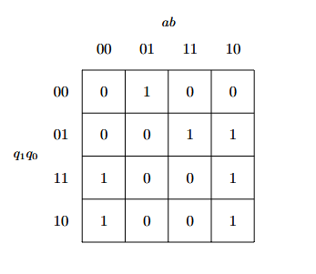
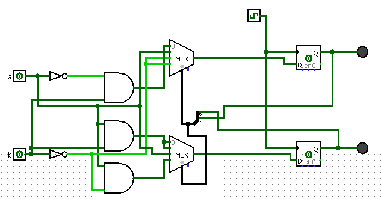

# E-portfolio & Projektarkiv – Jonas Sedig
**Civilingenjörsstudent inom Informationsteknik | KTH (Årskurs 2)**

Hej! Denna portfölj fungerar som en konkret samling av mina tekniska verk och praktiska prestationer. Mitt fokus ligger på nätverksteknik, maskinnära programmering och systemförståelse. 

### 📧 Kontakt & Länkar
- **E-post:** [jonas.sedig@icloud.com](mailto:jonas.sedig@icloud.com)
- **LinkedIn:** [linkedin.com/in/jonas-sedig](https://www.linkedin.com/in/jonas-sedig)
- **KTH Utbildningsplan:** [Civilingenjör Informationsteknik](https://www.kth.se/student/kurser/program/CINTE/20242/arskurs2)

---

### 🚀 Utvalda Prestationer & Tekniska Verk (Artefakter)

#### 🕹️ Lågnivåprogrammering: Pong-system för FPGA (Kurs: IS1200)
*Ett projekt som visar min förmåga att bygga applikationer i resursbegränsade miljöer direkt mot hårdvaruregister.*

- **Hårdvaruplattform:** DE10-Lite (FPGA) med en MIPS-baserad mjukprocessor.
- **Tekniker:** C, MIPS Assembler, VGA-synkronisering, IO-registerstyrning.
- **Visuellt bevis:** [Se demo-video på dtek-v emulator](https://youtu.be/HHLjiTD5eXM)
- **Källkod:** [gits-15.sys.kth.se/jonsed/Pong-IS1200](https://gits-15.sys.kth.se/jonsed/Pong-IS1200)

##### 🛠️ Arkitektur och Kodstruktur
Kärnan i min del av projektet handlade om att hantera VGA-skärmens grafik och tidskritiska synkroniseringssignaler utan färdiga operativsystembibliotek. Nedan visas ett konkret exempel från min källkod på hur jag ritade ut grafik direkt i videominnet (framebuffern) och synkroniserade detta med hårdvaran:

```c
#define VBLANK_BIT_MASK (0x1) 

// Synkroniserar ritningen med skärmens uppdateringsfrekvens för att undvika flimmer
void wait_for_vblank(void) {
    while (!(VGA_CTRL[REG_OFFSET_STATUS] & VBLANK_BIT_MASK)) {}
    while (VGA_CTRL[REG_OFFSET_STATUS] & VBLANK_BIT_MASK) {}
}

// Skriver färgdata direkt till videominnet
void put_pixel(int x, int y, uint16_t color) {
    if (x < 0 || x >= WIDTH || y < 0 || y >= HEIGHT) return;
    VGA_PIXEL_DATA[y * WIDTH + x] = color;
}

// Ritar rektanglar (t.ex. spelarpaddlar och bollen) genom att anropa put_pixel
void draw_rectangle(int x, int y, int w, int h, uint16_t color) {
    for (int j = 0; j < h; j++) {
        for (int i = 0; i < w; i++) {
            put_pixel(x + i, y + j, color);
        }
    }
}
```

##### 💡 Analytisk Reflektion
Den största utmaningen var att uppdatera skärmen snabbt nog utan att orsaka flimmer eller att grafiken "bröts" (tearing). Lösningen blev att implementera `wait_for_vblank`-funktionen, som pollar VGA-kontrollerns statusregister och väntar in skärmens vertikala synkronisering (V-blank) innan nästa bildruta ritas. Att arbeta så här nära hårdvaruregister har gett mig en mycket bättre förståelse för hur minneshantering och I/O-system fungerar i praktiken.

---

#### 🔌 Fysisk Hårdvara: Konstruktion av Sekvenskretsar (Kurs: IE1204)
*Denna laboration demonstrerar min förmåga att gå från teoretisk logik och simulering till systematisk maskinvarufelsökning av en Finite State Machine (FSM).*

- **Koncept:** CMOS-teknik, Karnaughdiagram (K-maps), multiplexers (74HC253), D-vippor (74HC74) och boolesk minimering.
- **Konkret Verk:** [Laborationsredovisningar (YouTube-spellista)](https://www.youtube.com/playlist?list=PLeNJYwtfAsrL5AWMiNV-1yNhxKpj67W1A)

##### 📐 Konstruktionsmetodik (Teori till Praktik)
Processen inleddes med att översätta ett state-diagram till ett Karnaughdiagram för att minimera antalet logiska grindar som krävdes för att styra kretsens tillstånd.

*(Exempel på boolesk minimering via K-map för tillstånd q<sub>1</sub><sup>+</sup>)*

 

Den minimerade logiken simulerades därefter i Logisim för att verifiera funktionaliteten hos de dubbla 4:1 multiplexerna innan den fysiska implementationen påbörjades. 

*(Schematisk simulering i Logisim)*



Till sist byggdes kretsen fysiskt på breadboard med standard-IC-komponenter för styrning och logik, samt knappar och LEDs (röda och gröna) för in- och utmatning.

*(Färdigbyggd sekvenskrets)*


##### 💡 Analytisk Reflektion
Den stora utmaningen med laborationen var att koppla `select`-signalerna till multiplexerna korrekt, vilket inledningsvis orsakade felaktiga tillståndshopp. Genom metodisk felsökning identifierade och löste jag problemet. Att fysiskt bygga och felsöka dessa kretsar lärde mig hur flera komplexa komponenter, som multiplexrar, måste samspela felfritt i ett system, vilket är en avgörande lärdom för all typ av system- och nätverksadministration.

---

### 🏆 Övriga Tekniska Färdigheter
- **Programmering & Verktyg:** Java, Python, C, MIPS Assembler, Git, Linux/Unix-miljöer, Wireshark, MATLAB.
- **Nätverkskompetens:** Djupgående förståelse för OSI-modellen, TCP/IP-stacken, routing samt brandväggskonfiguration.
- **Utmärkelser:** Mottagare av *Joachim Westerlunds Stipendium* för framstående studieresultat inom fysik och naturvetenskap.
